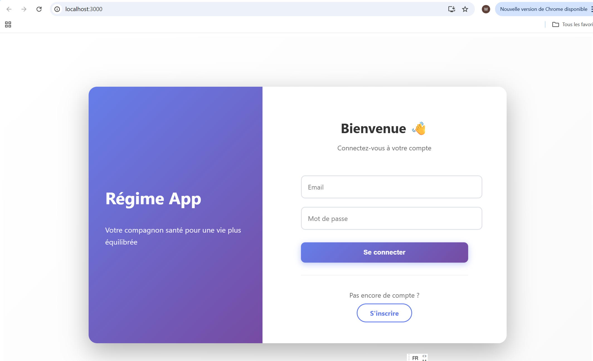
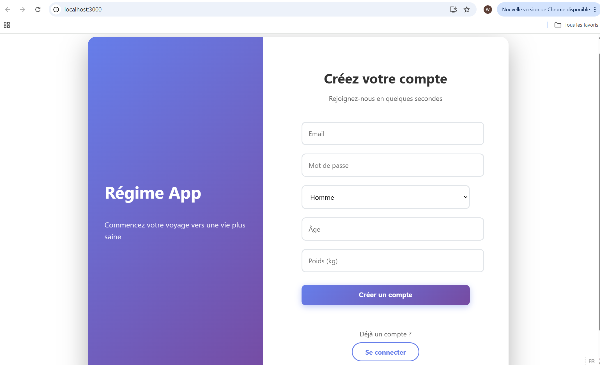
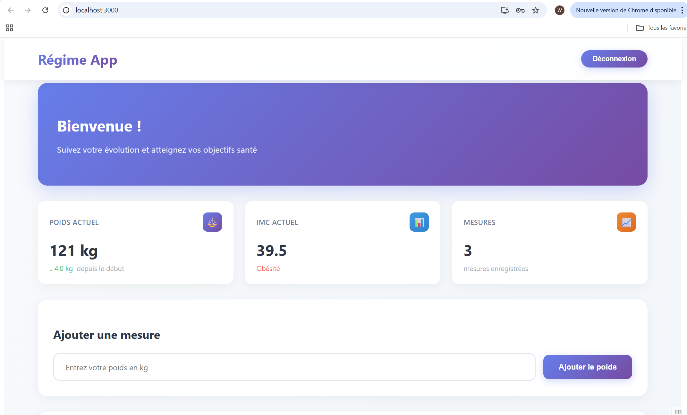
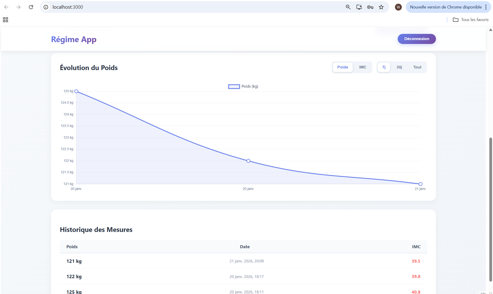

# Projet Poids Register 📊

Une application web de suivi du poids utilisant une architecture microservices avec Docker et Docker Compose.

## 📖 Présentation

**Poids Register** est une application permettant aux utilisateurs de :

- 📝 S'inscrire et créer un compte personnel
- 🔐 Se connecter pour sauvegarder les données
- ⚖️ Enregistrer leur poids au fil du temps
- 📈 Visualiser leur progression avec des graphiques
- 🧮 Calculer automatiquement leur IMC (Indice de Masse Corporelle)

L'application suit une architecture **microservices** modulaire et scalable, déployée entièrement avec **Docker**.

---

## 🏗️ Architecture

### Diagramme général

```
┌─────────────────────────────────────────────────────────────┐
│                    Docker Network                           │
├─────────────────────────────────────────────────────────────┤
│                                                             │
│  ┌──────────────────┐     ┌──────────────────┐              │
│  │   FRONTEND       │     │    BACKEND       │              │
│  │  (React/Port 80) │<───>│ (Node.js/3001)   │              │
│  │                  │     │                  │              │
│  └──────────────────┘     └─────────────────┘               │
│                                    │                        │
│                                    ▼                        │
│                           ┌──────────────────┐              │
│                           │  DATABASE        │              │
│                           │ (MySQL/Port 3306)│              │
│                           │                  │              │
│                           └──────────────────┘              │
│                                                             │
└─────────────────────────────────────────────────────────────┘
```

---

## 🔧 Microservices

### 1. **Frontend (React)**

**Port** : 3000 (port 80 dans le conteneur)

**Description** : Interface utilisateur web responsive

**Fonctionnalités** :

- Page d'accueil avec bienvenue
- Formulaire d'inscription (SignupForm)
- Formulaire de connexion (LoginForm)
- Dashboard avec graphiques et suivi du poids
- Styles CSS personnalisés

**Dépendances principales** :

- React 19
- Chart.js (graphiques)
- React-ChartJS-2 (intégration)

**Structure** :

```
frontend/poidsregister/
├── public/
│   ├── index.html
│   └── manifest.json
├── src/
│   ├── components/
│   │   ├── Dashboard.js
│   │   ├── LoginForm.js
│   │   ├── PageAccueil.js
│   │   └── SignupForm.js
│   ├── App.js
│   ├── App.css
│   ├── index.js
│   └── index.css
├── Dockerfile
└── package.json
```

---

### 2. **Backend (Node.js/Express)**

**Port** : 3001

**Description** : API REST gérant la logique métier et l'accès aux données

**Endpoints** :

| Méthode | Route              | Description                     |
| ------- | ------------------ | ------------------------------- |
| `POST`  | `/signup`          | Créer un nouvel utilisateur     |
| `POST`  | `/login`           | Authentifier un utilisateur     |
| `GET`   | `/weights/:userId` | Récupérer l'historique du poids |
| `POST`  | `/weights`         | Enregistrer une nouvelle pesée  |

**Fonctionnalités** :

- Gestion des utilisateurs (inscription, connexion)
- Calcul automatique de l'IMC
- Enregistrement de l'historique du poids
- Requêtes sécurisées à la base de données

**Dépendances principales** :

- Express 5.2.1
- MySQL2/Promise (pool de connexions asynchrone)
- CORS (partage des ressources cross-origin)
- Body-Parser (parsing des requêtes JSON)

### 3. **Base de Données (MySQL)**

**Port** : 3306

**Description** : Stockage persistant des données utilisateur

**Configuration** :

- Image : `mysql:8`
- Base de données : `regime`
- Utilisateur root : `root`
- Mot de passe : `root`

**Schéma de données** :

**Table `users`** :

```sql
- id (INT, PRIMARY KEY)
- email (VARCHAR)
- password (VARCHAR)
- sexe (VARCHAR)
- age (INT)
```

**Table `weights`** :

```sql
- id (INT, PRIMARY KEY)
- user_id (INT, FOREIGN KEY)
- poids (FLOAT)
- imc (FLOAT)
- date (TIMESTAMP)
```

**Initialisation** :
Les scripts SQL sont chargés depuis `db/init/init.sql` au démarrage du conteneur.

---

## 🐳 Docker et Docker Compose

### Qu'est-ce que Docker ?

Docker est une plateforme de **conteneurisation** qui permet de :

- Empaqueter l'application avec toutes ses dépendances
- Garantir que l'application fonctionne identiquement partout
- Isoler les processus pour plus de sécurité
- Faciliter le déploiement et la scalabilité

### Qu'est-ce que Docker Compose ?

Docker Compose est un outil pour :

- **Définir** plusieurs services dans un fichier YAML
- **Orchestrer** plusieurs conteneurs
- **Gérer** les volumes (données persistantes)
- **Configurer** les réseaux et dépendances

## 💻 Installation

### Prérequis

- [Docker](https://www.docker.com/products/docker-desktop) installé
- [Docker Compose](https://docs.docker.com/compose/) (généralement inclus)
- Git

### Étapes d'installation

1. **Clonez ou accédez au répertoire du projet** :

```bash
cd "\projet docker"
```

2. **Construisez et démarrez les conteneurs** :

```bash
docker-compose up -d --build
```

Cette commande :

- `-d` : Lance les services en arrière-plan
- `--build` : Reconstruit les images Docker

3. **Vérifiez le statut** :

```bash
docker-compose ps
```

Vous devriez voir 3 services actifs : `db`, `backend`, `frontend`

---

## 🚀 Utilisation

### Accès aux services

- **Frontend (Interface Web)** : http://localhost:3000
- **Backend (API)** : http://localhost:3001
- **Base de données** : localhost:3306

### Flux d'utilisation applicatif

1. **L'utilisateur accède** à http://localhost:3000 (Frontend React)
2. **L'utilisateur s'inscrit** avec email, mot de passe, sexe, âge, poids
3. **Le Frontend envoie** une requête POST à `http://backend:3001/signup`
4. **Le Backend** crée l'utilisateur et enregistre le poids initial
5. **Le Backend calcule** l'IMC et sauvegarde dans MySQL
6. **L'utilisateur se connecte** via le formulaire de login
7. **Le Dashboard** affiche le graphique d'évolution du poids
8. **L'utilisateur peut enregistrer** de nouvelles pesées

---

## 📁 Structure du projet

```
projet docker/
├── docker-compose.yml          # Orchestration des services
├── README.md                   # Ce fichier
│
├── backend/                    # Service API Node.js
│   ├── Dockerfile
│   ├── server.js              # Point d'entrée
│   ├── package.json
│   └── node_modules/
│
├── frontend/                   # Service Interface Web
│   └── poidsregister/
│       ├── Dockerfile
│       ├── package.json
│       ├── public/            # Fichiers statiques
│       │   └── index.html
│       └── src/               # Code source React
│           ├── App.js
│           ├── components/
│           ├── index.js
│           └── ...
│
└── db/                         # Configuration Base de Données
    └── init/
        └── init.sql          # Scripts d'initialisation
```

---

## 📝 Notes importantes

- Les mots de passe sont actuellement stockés en **plain text** (non recommandé pour la production)
- L'IMC est calculé avec une taille fixe de 1.7m (peut être personnalisée)
- La base de données `regime` est créée automatiquement au premier démarrage
- Les volumes persistants (`db_data`) conservent les données même après `docker-compose down`

---

## Résultats

### Page d'accueil:


---

### Login:

## 

### Register:

## 

### Dashboard:




**Projet créé avec ❤️ en utilisant Docker et l'architecture microservices**
